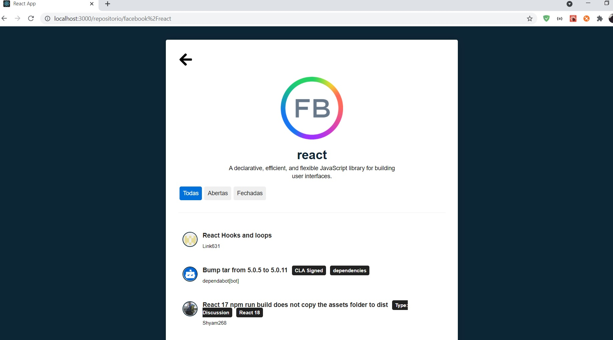

# Repositórios favoritos

A aplicação tem o objetivo de salvar repositórios favoritos.

#### Acesse:
- https://repos-favoritos.netlify.app/

### Página Home da Aplicação

Nesta sessão é possivel inserir os repositórios, para isso informe o nome e o projeto que desejar salvar.

<h1 align="center">
    
</h1>

Detalhes do repositorio 

<h1 align="center">
    
</h1>

Made with 💜 by Viviane Oliveira
